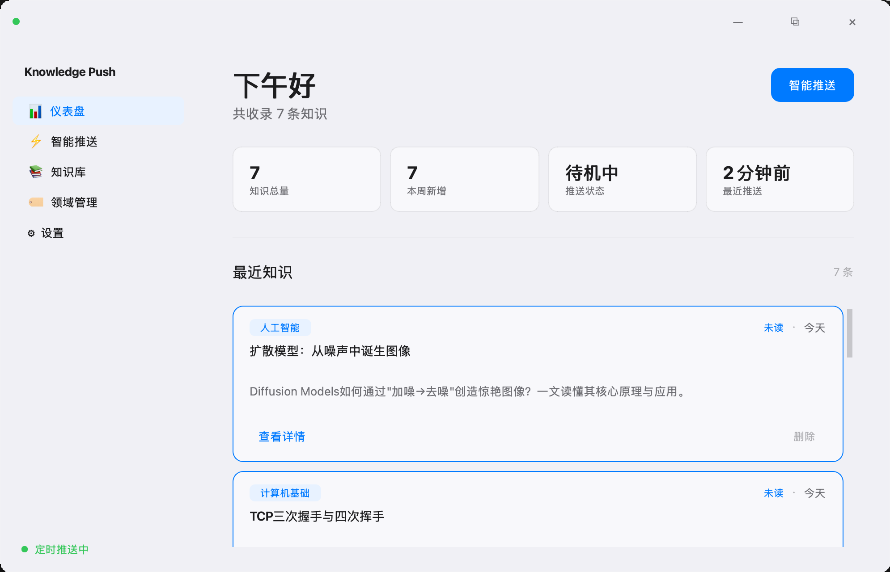
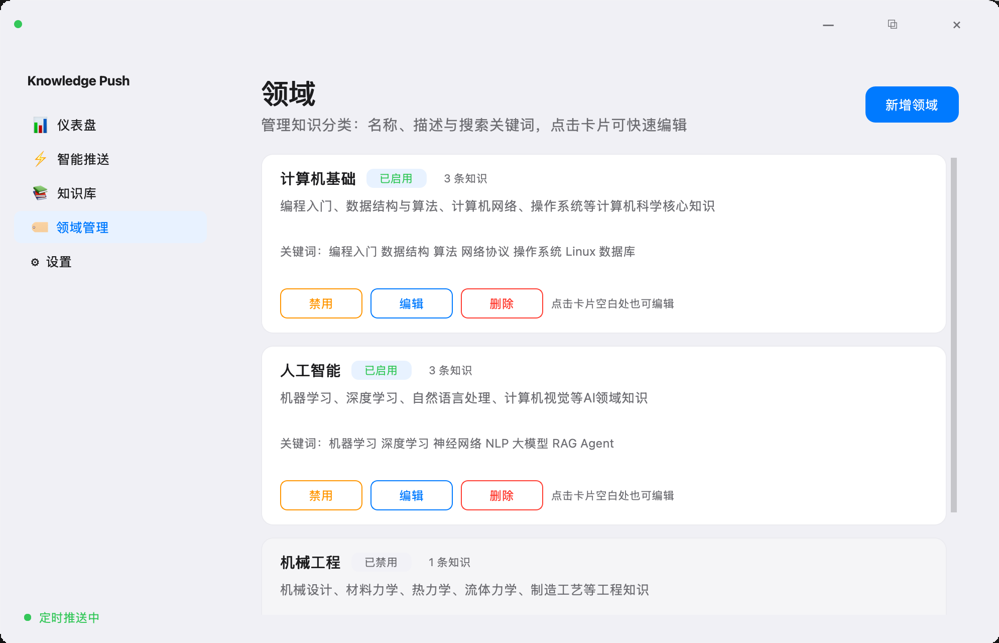
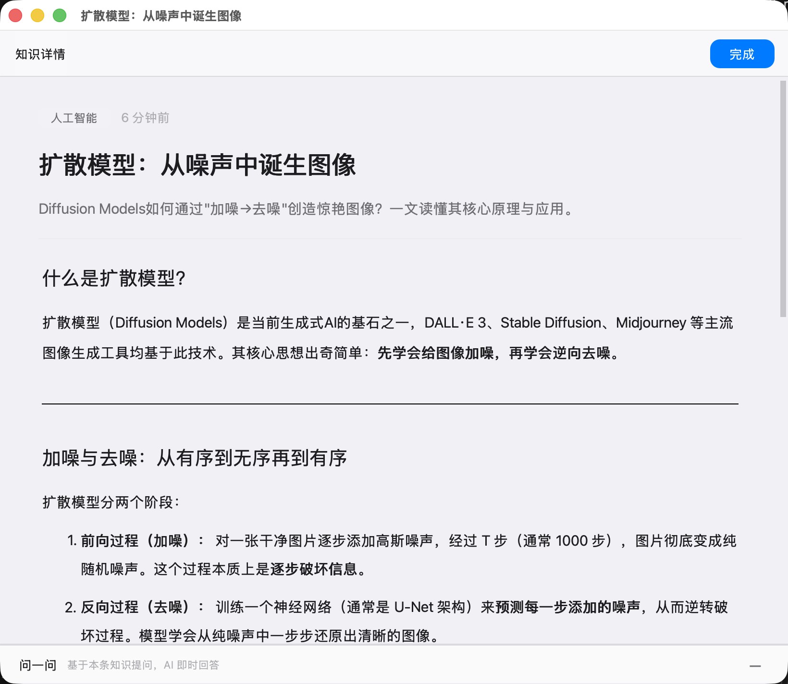

# Knowledge Push Assistant

**AI Agent 驱动的桌面端知识推送应用**  
定时推送个性化知识卡片 · 自主决策 · 模型无关 · 零硬编码


<p align="center">
  
  &nbsp;&nbsp;
  
  &nbsp;&nbsp;
  
</p>

---

## 这是什么

Knowledge Push Assistant 是一个运行在本地的桌面应用。它内置 **ReAct Agent**（思考→行动→观察循环），定时自主分析你的知识偏好，为你推送高质量的学习知识点。每条知识卡片包含标题、摘要和 Markdown 长文详情，支持按领域分类、搜索和收藏。

**核心理念**：Agent 自主决策「推不推、推什么、怎么推」——不需要你手动找内容，也不需要你告诉它每天推什么。它读你的设置、历史、反馈，自己做决定。

## 特性

- **Agent 自主决策** — ReAct 循环引擎，每一步思考/工具调用/结果都在 UI 中实时可见
- **模型无关** — 支持任意 OpenAI 兼容 API（DeepSeek、OpenAI、Ollama、Groq 等），一键切换
- **零硬编码** — 知识领域、System Prompt、推送策略均可通过 UI 配置，无需改代码
- **知识管理** — 领域分类、搜索筛选、Markdown 详情、收藏评分、删除管理
- **问一问** — 详情页内置 AI 问答栏，基于当前知识内容即时回答你的问题
- **定时推送** — 可配置间隔与时段；关闭窗口后托盘常驻，推送成功时 macOS / Windows 托盘气泡通知
- **毛玻璃 UI** — 现代化毛玻璃设计语言，macOS / Windows 原生风格

## 快速开始

```bash
# 克隆仓库
git clone https://github.com/zzzyx28/KnowledgePushAssistant.git
cd KnowledgePushAssistant

# 安装依赖
pip install -r requirements.txt

# 启动应用
python run.py
```

启动后：

1. 进入「设置」页面，配置你的 LLM API Key、Base URL 和模型名称（默认指向 DeepSeek）
2. 在「领域管理」页面查看或自定义知识领域
3. 回到仪表盘，点击「智能推送」一键触发 Agent，或等待定时推送自动执行（需保持应用在托盘运行）

## 项目结构

```
├── run.py                       # 启动入口
├── requirements.txt
├── pyproject.toml               # 项目元数据
├── LICENSE                      # MIT
├── assets/
│   └── screenshots/             # 效果截图（提交前请放入实际截图）
├── scripts/
│   ├── package_macos.sh         # macOS DMG 打包脚本
│   └── package_windows.bat      # Windows exe 打包脚本
├── src/
│   ├── main.py                  # 应用入口：托盘、调度器、窗口初始化
│   ├── config.py                # 路径与默认配置
│   ├── agent/
│   │   ├── react_loop.py        # ReAct 循环生成器（核心引擎）
│   │   ├── tools.py             # 10 个工具：JSON Schema + 实现
│   │   └── defaults.py          # 默认 System Prompt 与预设领域
│   ├── llm/
│   │   └── client.py            # OpenAI 兼容客户端封装
│   ├── search/
│   │   └── web_search.py        # DuckDuckGo 搜索 + 网页抓取
│   ├── storage/
│   │   ├── models.py            # SQLAlchemy ORM 模型
│   │   ├── repository.py        # 数据访问层（CRUD + 统计）
│   │   └── migrations.py        # 自动建表 + 种子数据
│   ├── scheduler/
│   │   └── push_scheduler.py    # APScheduler 定时推送调度
│   └── ui/
│       ├── main_window.py       # 主窗口（frameless + 圆角）
│       ├── title_bar.py         # 可拖拽标题栏
│       ├── sidebar.py           # 侧边栏导航
│       ├── tray_notify.py       # 托盘气泡通知（macOS / Windows）
│       ├── detail_window.py     # 知识详情 + 问答面板
│       ├── styles.py            # 全局样式令牌与工厂函数
│       ├── widgets.py           # 可复用组件
│       ├── markdown_html.py     # Markdown → HTML 渲染
│       ├── knowledge_ask.py     # 问答 System Prompt 构建
│       ├── knowledge_card.py    # 知识卡片组件
│       └── pages/
│           ├── dashboard.py     # 仪表盘（问候 + 统计 + 最近知识）
│           ├── agent_panel.py   # Agent 执行时间线
│           ├── knowledge.py     # 知识库列表 + 搜索筛选
│           ├── domain_manager.py # 领域增删改查
│           └── settings.py      # 推送设置 + 模型配置
```

## Agent 工作流

```
用户触发 / 定时触发
       │
       ▼
   ReAct 循环开始
       │
       ├─ 第 1 轮: 并行读取用户设置 + 领域信息 + 推送历史
       │         （listDomains / readUserSettings / readPushHistory）
       │
       ├─ 第 2 轮: 选定领域 → 撰写知识卡片 → pushKnowledgeCard
       │
       └─ 决策完成: 弹出通知 / 静默跳过
```

Agent 每一步的思考过程、工具调用和返回结果都在「智能推送」页面以时间线形式实时展示。

## 内置工具


| 工具                  | 描述                        |
| ------------------- | ------------------------- |
| `listDomains`       | 获取所有自定义领域（含启用状态、关键词）      |
| `getDomainStats`    | 获取各领域知识条数统计               |
| `readUserSettings`  | 读取推送开关、间隔、时段等设置           |
| `readPushHistory`   | 读取最近推送记录，避免重复             |
| `readUserFeedback`  | 读取用户对推送的反馈                |
| `getCurrentTime`    | 获取当前日期和星期                 |
| `searchWeb`         | DuckDuckGo 搜索（可选，每轮限 1 次） |
| `fetchWebContent`   | 抓取网页正文（可选，每轮限 1 次）        |
| `pushKnowledgeCard` | 撰写并保存知识卡片，触发推送通知          |
| `skipPush`          | 跳过本次推送（仅限时机/设置不适时）        |


## 配置

所有配置通过 UI 完成，无需手动编辑文件：

- **推送计划**：开关、间隔（5-1440 分钟）、时段（起止时间）
- **模型连接**：API Key、Base URL、模型名称，支持一键测试连接
- **Agent 策略**：系统提示词（只读，保护核心行为规则）+ 用户偏好提示词（可自定义推送风格与关注主题）
- **领域管理**：增删改查，名称、描述、关键词，启用/禁用

数据存储在用户数据目录（`~/.config/KnowledgePushAssistant/`），使用 SQLite。

### 推送通知与托盘

- 关闭主窗口后应用**不会退出**，继续在系统托盘运行，定时推送照常执行。
- 推送成功后在托盘显示气泡（标题 + 摘要）；**点击气泡**打开知识详情。
- 托盘菜单：打开主面板、立即推送、退出。
- **Windows**：左键打开主窗口，**右键**弹出菜单。
- **macOS**：**单击**弹出菜单，**双击**打开主窗口（系统托盘通常不区分左右键）。
- 完全退出请使用托盘菜单「退出」；勿在任务管理器中结束进程若需保持定时推送。

## 打包发布

### macOS DMG

```bash
bash scripts/package_macos.sh
# 输出: dist/KnowledgePushAssistant.dmg
```

### Windows 单文件

```batch
scripts\package_windows.bat
REM 输出: dist\KnowledgePushAssistant.exe
```

打包依赖 PyInstaller。如需安装程序，可配合 NSIS（Windows）或 create-dmg（macOS）进一步定制。

发布前可运行检查脚本：

```bash
bash scripts/pre_release_check.sh
```

## 技术栈


| 层       | 技术                             |
| ------- | ------------------------------ |
| UI 框架   | PySide6 (Qt 6)                 |
| LLM 客户端 | openai >= 1.0                  |
| 搜索引擎    | DuckDuckGo (duckduckgo_search) |
| 数据库     | SQLite + SQLAlchemy 2.0        |
| 定时任务    | APScheduler                    |
| 打包      | PyInstaller                    |


## 贡献

欢迎 Issue 和 PR。请先阅读 `assets/screenshots/` 中的截图了解当前 UI 状态。

```bash
# 开发模式运行
python run.py
```

## 许可证

MIT License © 2025 Knowledge Push Assistant Contributors

---

如果你觉得这个项目有用，请给一个 ⭐ Star