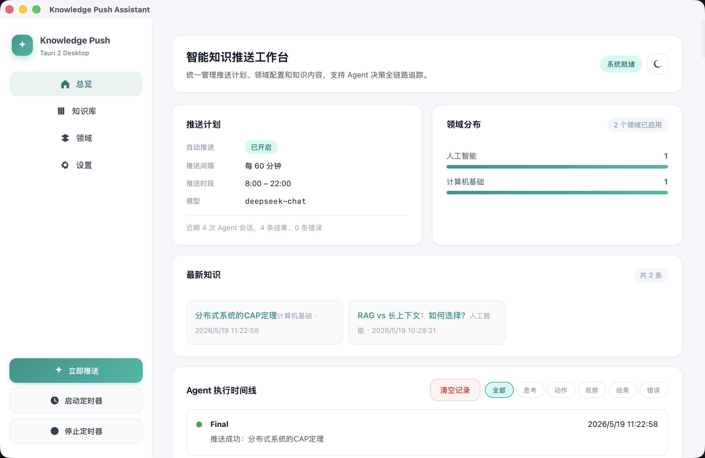
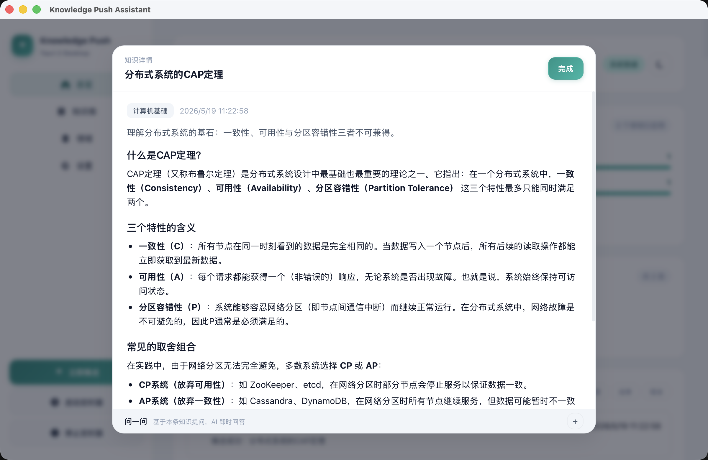
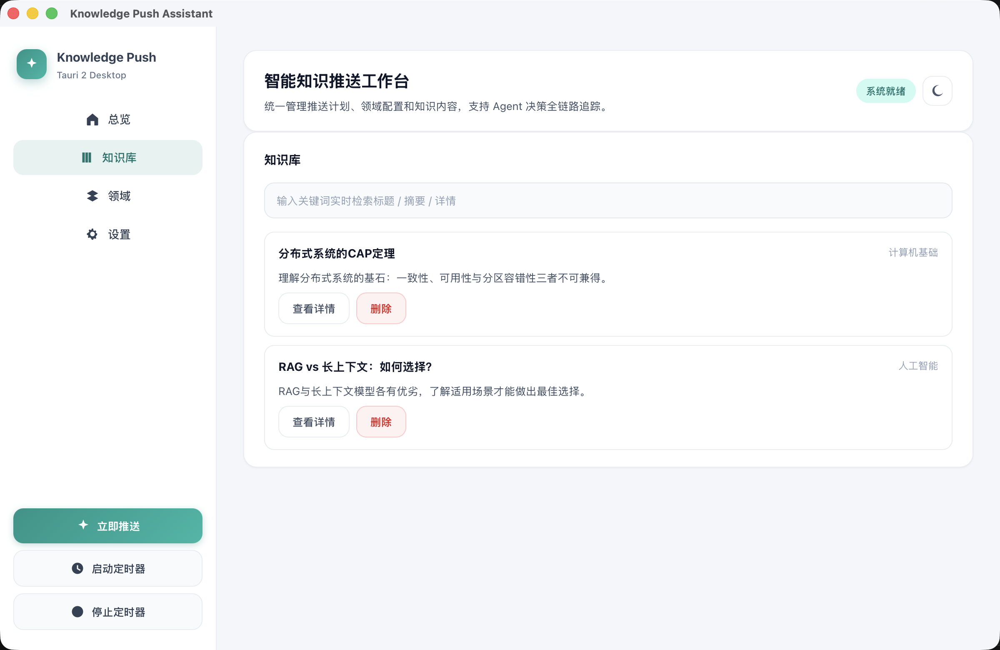
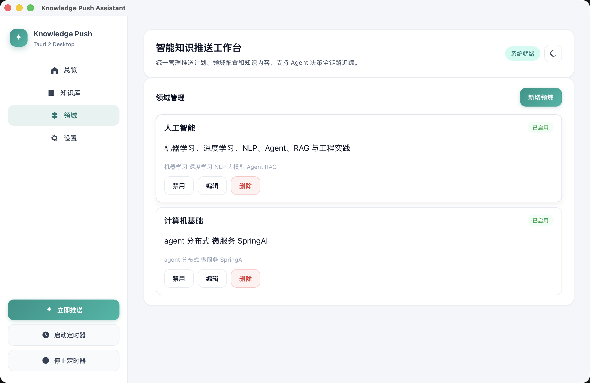
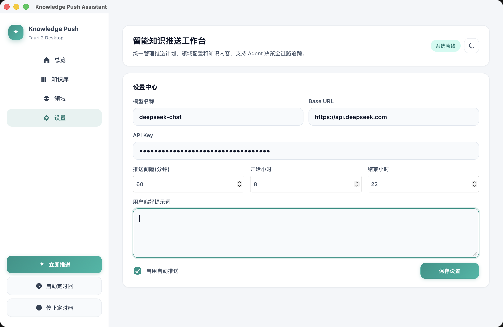

<p align="center">
  
</p>

<h1 align="center">Knowledge Push Assistant</h1>

<p align="center">
  <strong>AI Agent 驱动的桌面端知识推送应用</strong><br/>
  定时推送个性化知识卡片 · ReAct Agent 自主决策 · 模型无关 · 零硬编码
</p>

<p align="center">
  
  
  
  
  
</p>

---

<p align="center">
  
</p>

## 这是什么

Knowledge Push Assistant 是一个运行在本地的桌面应用，基于 **Tauri 2 + React + TypeScript**。它内置 **ReAct Agent**（思考 → 行动 → 观察循环），定时自主分析你的知识偏好，推送高质量的学习知识点。每条知识卡片包含标题、摘要和 Markdown 长文详情，支持按领域分类和搜索。

Agent 自主决策「推不推、推什么、怎么推」——不需要你手动找内容，也不需要预设推送内容。它读取你的设置、领域配置、推送历史和用户反馈，自己做出判断。

## 效果预览

<p align="center">
  
  &nbsp;
  
</p>

<p align="center">
  
  &nbsp;
  
</p>

## 特性

- **Agent 自主决策** — ReAct 循环引擎，每一步思考 / 工具调用 / 结果在时间线中实时可见
- **模型无关** — 支持任意 OpenAI 兼容 API（DeepSeek、OpenAI、Ollama、Groq 等），一键切换
- **零硬编码** — 知识领域、System Prompt、推送策略均可通过 UI 配置，无需改代码
- **知识管理** — 领域分类、搜索筛选、Markdown 详情、评分与收藏
- **定时推送** — 可配置间隔与时段；关闭窗口后托盘常驻，推送时弹出系统通知
- **深色模式** — 亮色 / 暗色主题自由切换
- **跨平台** — macOS / Windows / Linux 原生体验

## 快速开始

```bash
# 克隆仓库
git clone https://github.com/zzzyx28/KnowledgePushAssistant.git
cd KnowledgePushAssistant/desktop

# 安装依赖
npm install

# 启动开发模式
npm run tauri dev
```

启动后三步上手：

1. 进入 **设置** 页面，配置 LLM API Key、Base URL 和模型名称
2. 在 **领域管理** 页面查看或自定义知识领域
3. 回到仪表盘，点击「立即推送」一键触发 Agent，或启动定时器自动推送

## Agent 工作流

```
用户触发 / 定时触发
       │
       ▼
   ReAct 循环 (最多 6 轮)
       │
       ├─ 第 1 轮  并行读取用户设置 + 领域列表 + 推送历史
       │           (readUserSettings / listDomains / readPushHistory)
       │
       ├─ 第 2 轮  分析反馈与统计 → 选定领域 → 撰写知识卡片
       │           (readUserFeedback / getDomainStats / pushKnowledgeCard)
       │
       └─ 决策完成  推送通知 / 静默跳过
```

Agent 每一步的思考过程、工具调用和返回结果都在仪表盘以时间线形式实时展示。

## 内置工具

| 工具 | 描述 |
| --- | --- |
| `readUserSettings` | 读取推送开关、间隔、时段、模型配置 |
| `listDomains` | 获取所有领域（含启用状态、关键词） |
| `readPushHistory` | 读取最近推送记录，避免短期重复 |
| `readUserFeedback` | 读取用户评分与收藏反馈，指导偏好 |
| `getDomainStats` | 获取各领域知识条数与平均评分 |
| `pushKnowledgeCard` | 撰写并保存知识卡片，触发推送通知 |
| `skipPush` | 跳过本次推送（用于不适合推送的时机） |

## 配置

所有配置通过 UI 完成，无需手动编辑文件：

| 类别 | 可配置项 |
| --- | --- |
| 推送计划 | 开关、间隔（5-1440 分钟）、时段（起止小时） |
| 模型连接 | API Key、Base URL、模型名称 |
| Agent 策略 | 用户偏好提示词（自定义推送风格与关注主题） |
| 领域管理 | 名称、描述、关键词，启用 / 禁用 |

数据存储在应用本地目录，使用 SQLite。

### 托盘与通知

- 关闭主窗口后应用常驻系统托盘，定时推送照常执行
- 推送成功时弹出系统通知
- 托盘菜单：打开主面板、立即推送、打开最新推送、退出
- 左键单击托盘图标打开主窗口

## 项目结构

```
├── desktop/
│   ├── index.html                          # HTML 入口
│   ├── package.json                        # npm 配置
│   ├── tsconfig.json                       # TypeScript 配置
│   ├── vite.config.ts                      # Vite 构建配置
│   ├── src/
│   │   ├── main.tsx                        # React 入口
│   │   ├── App.tsx                         # 根组件（状态管理 + 路由）
│   │   ├── styles.css                      # 全局样式（亮色 + 暗色）
│   │   ├── components/
│   │   │   ├── icons.tsx                   # SVG 图标组件
│   │   │   ├── Sidebar.tsx                 # 侧边栏导航 + 操作按钮
│   │   │   ├── Dashboard.tsx               # 仪表盘（指标 / 推送历史 / 时间线）
│   │   │   ├── KnowledgeList.tsx            # 知识库搜索 + 卡片列表
│   │   │   ├── DomainManager.tsx            # 领域增删改查
│   │   │   ├── Settings.tsx                # 设置表单
│   │   │   └── DetailOverlay.tsx           # 知识详情弹窗
│   │   └── core/
│   │       ├── types.ts                    # TypeScript 类型定义
│   │       ├── db.ts                       # SQLite 初始化 + Schema DDL
│   │       ├── defaults.ts                 # 默认设置 + 预设领域
│   │       ├── repository.ts               # 数据访问层（CRUD + 统计）
│   │       ├── scheduler.ts                # 浏览器端定时调度器
│   │       └── agent/
│   │           └── service.ts              # ReAct Agent 引擎 + 工具实现
│   └── src-tauri/
│       ├── Cargo.toml                      # Rust 依赖
│       ├── tauri.conf.json                 # Tauri 配置
│       ├── capabilities/default.json       # 权限声明
│       └── src/
│           ├── main.rs                     # Rust 入口
│           └── lib.rs                      # 系统托盘 + Tauri 命令
├── assets/
│   ├── icon.icns                           # macOS 应用图标
│   ├── icon.ico                            # Windows 应用图标
│   └── screenshots/                        # 效果截图
├── .github/workflows/release.yml           # CI 自动构建发布
├── LICENSE                                 # MIT
└── README.md
```

## 打包发布

```bash
cd desktop
npm run tauri build
```

构建产物在 `desktop/src-tauri/target/release/bundle/` 下：

- **macOS** → `.dmg` + `.app`
- **Windows** → `.msi` + `.exe`
- **Linux** → `.deb` + `.AppImage`

CI 通过 GitHub Actions 自动构建，推送 `v*` 标签时触发。

## 技术栈

| 层 | 技术 |
| --- | --- |
| 桌面框架 | Tauri 2 (Rust) |
| 前端 | React 18 + TypeScript |
| 构建工具 | Vite 5 |
| LLM 客户端 | Fetch API（OpenAI 兼容接口） |
| 数据库 | SQLite（@tauri-apps/plugin-sql） |
| 通知 | @tauri-apps/plugin-notification |

## 许可证

MIT License © 2025 Knowledge Push Assistant Contributors

---

<p align="center">如果你觉得这个项目有用，请给一个 ⭐ Star</p>
